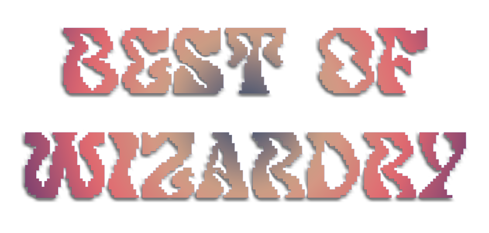

#

Best Of Wizardry es un prototipo de juego desarrollado en Unity utilizando Netcode for GameObjects, creado por un único desarrollador en un período de 3 meses como parte de un portfolio personal. Se trata de un ejercicio de aprendizaje y demostración de habilidades propias en el desarrollo de juegos multijugador.

Pequeño video gameplay de baja calidad: https://youtu.be/a8WBG4uEDYk

### Descripción

El juego ofrece un prototipo funcional con características básicas de red, diseñado para explorar y aplicar Netcode for GameObjects en Unity. Incorpora funcionalidad multijugador con soporte tanto para host como para servidor dedicado, utilizando Unity Gaming Services, integrando:

- Matchplay

- Hosting

- Lobby

- Relay

### Archivos adicionales

El repositorio incluye la siguiente documentación:

- Game Design Document (GDD): Documento elaborado como parte de un trabajo académico centrado en el diseño del juego. No está destinado a la publicación del juego, por lo que las secciones relacionadas con costes de desarrollo pueden ser omitidas.

- Memoria del proyecto: Contiene explicaciones concisas sobre el código y las decisiones técnicas adoptadas durante el desarrollo.

### Código fuente

Para empresas o entidades interesadas en revisar el código fuente, por favor contactarme a través del correo electrónico:

📧 sergio.perez.fdez0@gmail.com

### Instalación y ejecución

Para ejecutar el proyecto, sigue estos pasos:

1. Clonar el repositorio.

2. Abrir la carpeta Game.

3. Ejecutar BestOfWizardry.exe.

⚠️ Es posible que se requiera aceptar permisos del firewall para garantizar el correcto funcionamiento del juego.

### Notas

Este proyecto es de carácter experimental, por lo que pueden presentarse errores.

### Contacto

Para cualquier consulta o sugerencia, puedes comunicarte a través del siguiente correo electrónico:

📧 sergio.perez.fdez0@gmail.com

